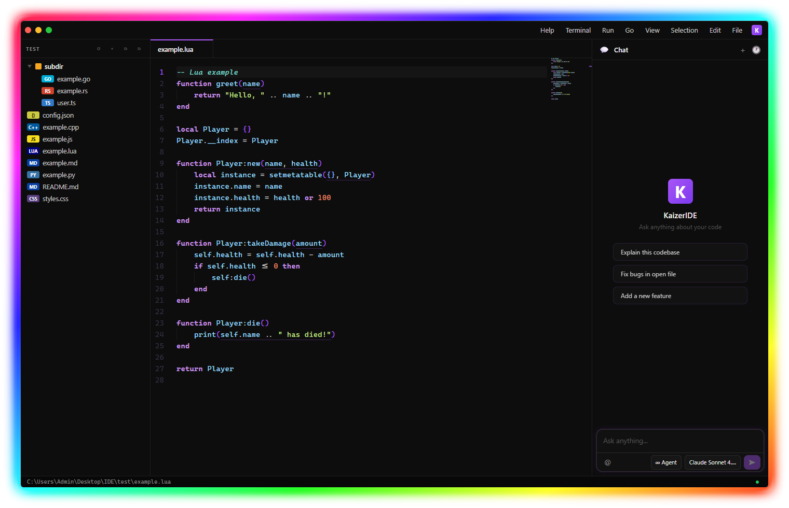
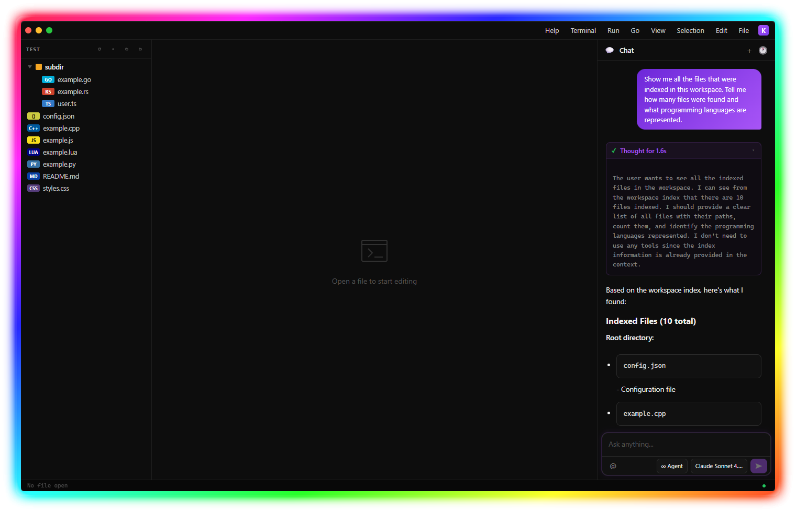
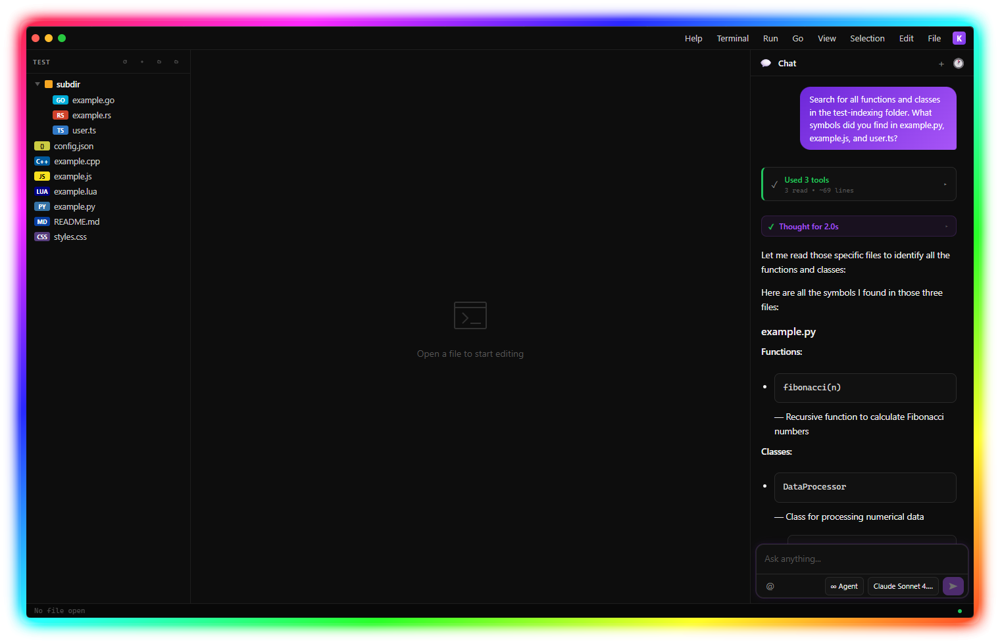
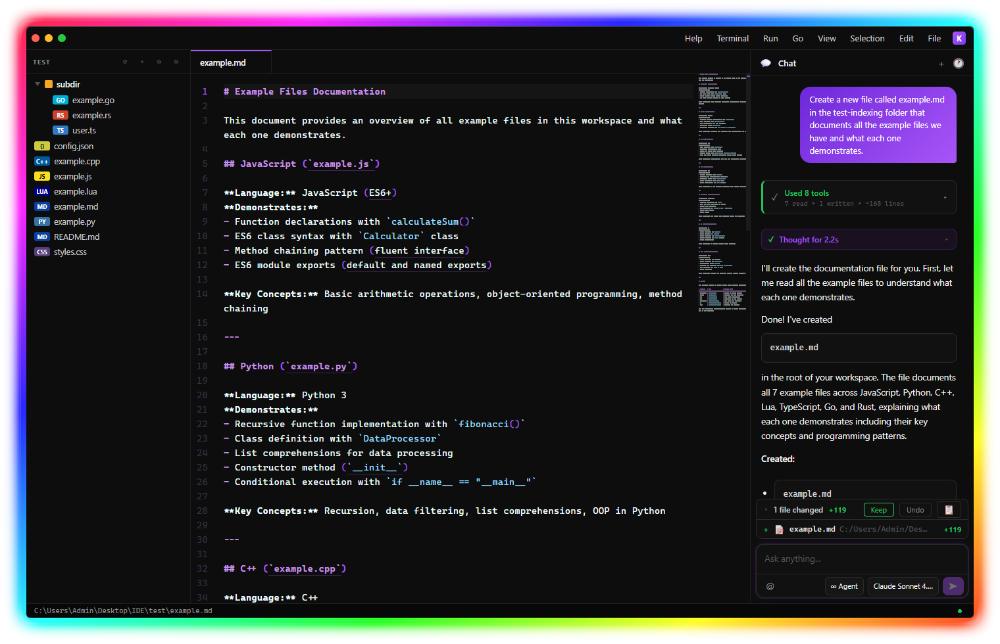
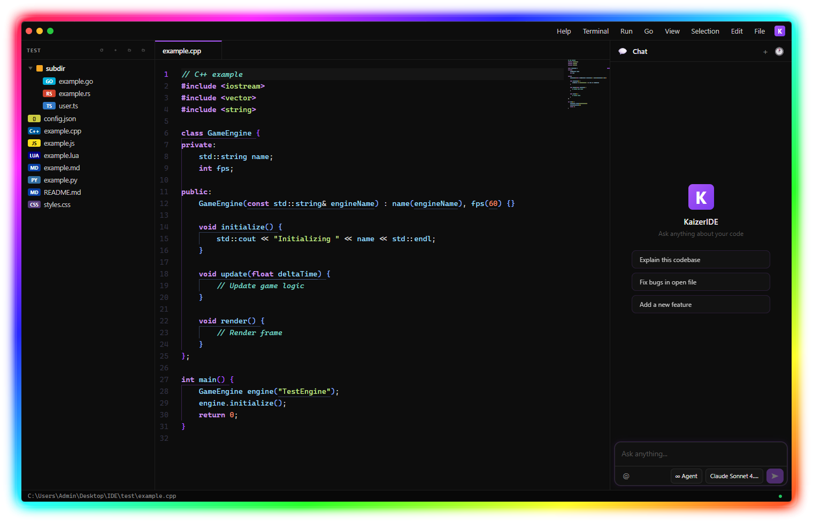
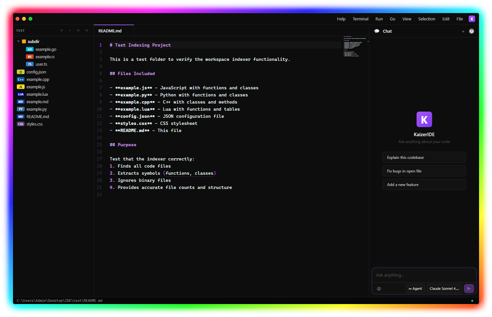
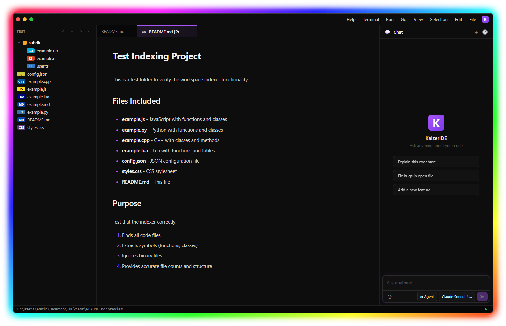
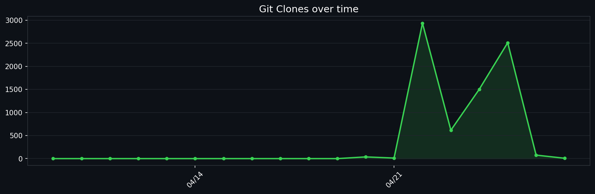

  

<h1 align="center">KaizerIDE</h1>

  <strong>AI-Powered Desktop IDE — local-first, zero telemetry, direct API control</strong>

  
  
  
  

  <a href="https://github.com/randheimer/KaizerIDE/releases"><strong>⬇️ &nbsp;Download for Windows</strong></a>

  

---

## What is KaizerIDE?

KaizerIDE is a lightweight desktop IDE that pairs a full Monaco code editor with a multi-agent AI assistant — and keeps everything under your control. No telemetry, no required account. AI requests go directly to the endpoint you configure, including local models running on your own machine.

It ships with **local workspace indexing** so the AI understands your entire codebase instantly, without cloud embeddings or external services.

---

## 🚀 Skonester Fork Enhancements

This fork supercharges KaizerIDE with deep local AI integration and optimized performance:

- **Automated AI CLI Tooling**: Instantly setup professional AI tools including Gemini CLI, Claude Code, Qwen, and more with a single command.
- **Local AI Bridge Server**: Dedicated LiteLLM-powered bridge for seamless connectivity between the IDE and **Ollama**.
- **GPU-Optimized Qwen Integration**: Pre-configured to use **Ollama** as the backend, specifically optimized for **Qwen 2.5 Coder** with forced GPU acceleration for instant responses.
- **One-Click Setup**: New npm scripts for rapid environment initialization:
  - `npm run install-ai-clis`: Installs and configures the AI CLI suite.
  - `npm run start-ai`: Launches the local AI bridge server.

See the **[Quick Start](QUICK_START.md)** for setup instructions.

---

## Features

<table>
  <tr>
    <td width="50%" valign="top">
      <h3>🤖 Multi-Agent AI</h3>
      Four specialized modes — <strong>Agent</strong>, <strong>Planner</strong>, <strong>Ask</strong>, and <strong>Fixer</strong> — each with distinct tool access and behavior. Context pills attach files and selections without pasting.
    </td>
    <td width="50%" valign="top">
      <h3>💻 Monaco Editor</h3>
      The same editor core as VS Code — multi-tab editing, syntax highlighting for 100+ languages, IntelliSense, minimap, bracket colorization, and autosave.
    </td>
  </tr>
  <tr>
    <td valign="top">
      <h3>🔍 Local Workspace Indexing</h3>
      Indexes your entire codebase on open. Symbol extraction, fuzzy search, real-time file watching — 100% on-device, no cloud embeddings.
    </td>
    <td valign="top">
      <h3>⚡ Command Palette</h3>
      <code>Ctrl+Shift+P</code> — keyboard-first access to every IDE action. New file, save, toggle sidebar, settings, reindex, SSH connect, and more.
    </td>
  </tr>
  <tr>
    <td valign="top">
      <h3>🔐 Privacy-First Design</h3>
      Zero telemetry. No required account. Direct API routing — your AI requests never pass through a KaizerIDE proxy. Works fully offline with local models.
    </td>
    <td valign="top">
      <h3>🌐 SSH / SFTP Support</h3>
      Connect to remote servers and edit files directly from the IDE. Windows Explorer context-menu integration to open any folder in KaizerIDE.
    </td>
  </tr>
  <tr>
    <td valign="top">
      <h3>🎨 Modern UI</h3>
      Glassmorphism surfaces, accent color controls, compact mode, macOS and Windows window chrome themes, lazy-loaded modals for fast startup.
    </td>
    <td valign="top">
      <h3>🔧 Developer Tools</h3>
      Integrated terminal, settings panel, keyboard shortcuts, <code>.gitignore</code>-aware async file tree, and ESLint + Prettier quality tooling.
    </td>
  </tr>
</table>

---

## Screenshots

<table>
  <tr>
    <td align="center"></td>
    <td align="center"></td>
    <td align="center"></td>
  </tr>
  <tr>
    <td align="center"></td>
    <td align="center"></td>
    <td align="center"></td>
  </tr>
</table>

  <a href="SCREENSHOTS.md">View all screenshots →</a>

---

## Quick install

  <a href="https://github.com/randheimer/KaizerIDE/releases"><strong>⬇️ &nbsp;Download the latest release from GitHub Releases</strong></a>

1. Run `KaizerIDE-X.Y.Z.exe`.
2. Open a folder with `Ctrl+O`.
3. (Optional) Run `npm run install-ai-clis` to setup local AI tools.
4. Configure your AI endpoint in **Settings → General**.
5. Press `Ctrl+Shift+P` and start coding.

Optionally verify the SHA256 checksum shipped with each release. See the full **[Quick Start](QUICK_START.md)** for the complete first-run flow.

---

## Roadmap

| Milestone | Status |
| --- | --- |
| Core IDE — editor, tabs, file explorer, terminal | ✅ Complete |
| Multi-agent AI system (Agent / Planner / Ask / Fixer) | ✅ Complete |
| Local workspace indexing with real-time file watching | ✅ Complete |
| Local AI CLI suite (Gemini, Claude, Qwen, etc.) | ✅ Complete |
| Optimized local model support (Qwen 2.5 Coder + GPU) | ✅ Complete |
| Command palette, durable sessions, ESLint + Prettier | ✅ Complete |
| Git UI — visual diff and commit history | 🚧 In progress |
| Debugger integration | 📋 Planned |
| Custom themes and color schemes | 📋 Planned |
| Documentation generation from code | 📋 Planned |

---

## Documentation hub

| Start here | Description |
| --- | --- |
| **[Quick Start](QUICK_START.md)** | Install KaizerIDE, open your first folder, configure AI, and learn core shortcuts. |
| **[Configuration](CONFIGURATION.md)** | Set AI endpoints, editor preferences, appearance options, and indexing behavior. |
| **[Features](FEATURES.md)** | Browse the main product areas and jump into detailed feature docs. |
| **[Privacy](PRIVACY.md)** | Understand local-first guarantees, AI request routing, and workspace indexing privacy. |
| **[Trust & Positioning](TRUST.md)** | Compare KaizerIDE with other IDEs and review the enterprise trust model. |
| **[Building from Source](BUILDING.md)** | Run the app locally, build releases, and use linting/formatting commands. |

---

## Feature guides

| Guide | Covers |
| --- | --- |
| **[AI Assistant](features/AI_ASSISTANT.md)** | Multi-agent chat, context pills, tool calling, planning, streaming, durable sessions, and providers. |
| **[Editor](features/EDITOR.md)** | Monaco editing, tabs, syntax highlighting, IntelliSense, minimap, themes, and autosave. |
| **[File Management](features/FILE_MANAGEMENT.md)** | File explorer, search, `.gitignore` awareness, SSH/SFTP, context menus, and drag/drop. |
| **[UI & UX](features/UI_UX.md)** | Welcome screen, command palette, themes, appearance controls, glass effects, and lazy-loaded modals. |
| **[Developer Tools](features/DEVELOPER_TOOLS.md)** | Terminal, settings, shortcuts, workspace indexer pointers, and quality workflows. |
| **[Workspace Indexing](features/INDEXING.md)** | Local indexing, symbol extraction, search tools, cache behavior, performance, and troubleshooting. |

---

## Repository stats

---

## Project resources

| Resource | Link |
| --- | --- |
| **GitHub repository** | [randheimer/KaizerIDE](https://github.com/randheimer/KaizerIDE) |
| **Releases** | [Download builds](https://github.com/randheimer/KaizerIDE/releases) |
| **Bug reports** | [Open a bug issue](https://github.com/randheimer/KaizerIDE/issues/new?labels=bug) |
| **Feature requests** | [Request a feature](https://github.com/randheimer/KaizerIDE/issues/new?labels=enhancement) |
| **Contributing** | [Contribution guide](CONTRIBUTING.md) |
| **Security** | [Security policy](SECURITY.md) |
| **License** | [Custom License](LICENSE) |

---

## Support

- **Documentation** — Start with this hub and follow the topic links above.
- **Issues** — Use [GitHub Issues](https://github.com/randheimer/KaizerIDE/issues) for bugs and requests.
- **Community** — Star the project if KaizerIDE is useful to you.

---

  

  Made with ❤️ by the KaizerIDE team

  Built for developers who value privacy, speed, and AI assistance

